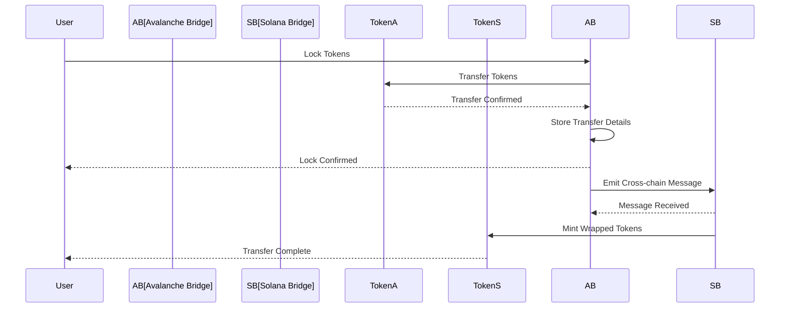

# Avalanche-Solana Bridge

A bridge implementation for transferring assets between Avalanche and Solana networks.

## Features

- Token wrapping/unwrapping
- Cross-chain messaging
- Transaction verification
- Event tracking
- Multi-signature security

## Architecture



## Contracts

1. **Avalanche Bridge Contract**
   - Token locking/unlocking
   - Cross-chain message emission
   - Event tracking
   - Security checks

2. **Solana Bridge Program**
   - Token wrapping/unwrapping
   - Message verification
   - PDA management
   - Security checks

## Setup

1. Install dependencies:
```bash
npm install
```

2. Configure environment variables:
```bash
cp .env.example .env
# Edit .env with your configuration
```

3. Deploy contracts:
```bash
# Deploy Avalanche contracts
npm run deploy:avalanche

# Deploy Solana program
npm run deploy:solana
```

## Usage

```typescript
import { AvalancheSolanaBridge } from './bridge';

// Initialize bridge
const bridge = new AvalancheSolanaBridge({
    avalanche: {
        rpcUrl: process.env.AVALANCHE_RPC_URL,
        bridgeAddress: process.env.AVALANCHE_BRIDGE_ADDRESS
    },
    solana: {
        rpcUrl: process.env.SOLANA_RPC_URL,
        programId: process.env.SOLANA_PROGRAM_ID
    }
});

// Transfer tokens
const transfer = await bridge.transfer({
    from: 'avalanche',
    to: 'solana',
    token: 'USDC',
    amount: '100.0',
    recipient: 'solana-address'
});

// Check transfer status
const status = await bridge.getTransferStatus(transfer.id);
```

## Security

- Multi-signature requirements
- Message verification
- Token wrapping security
- Event monitoring
- Transaction validation

## Development

```bash
# Run tests
npm test

# Deploy to testnet
npm run deploy:testnet

# Verify contracts
npm run verify
```

## Contributing

1. Fork the repository
2. Create a feature branch
3. Submit a pull request

## License

[License information to be added]

# Avalanche-Solana Bridge Contract

## Overview
This contract facilitates the transfer of ERC20 tokens between Avalanche and Solana networks. It allows users to lock tokens on Avalanche and receive them on Solana, with the bridge operator managing the cross-chain transfer.

## Features
- Support for multiple ERC20 tokens
- Secure token locking mechanism
- Transaction tracking and verification
- Owner-only administrative functions
- Emergency withdrawal capabilities

## Prerequisites
- Node.js (v14 or later)
- Hardhat
- Solana CLI tools
- Avalanche C-Chain RPC URL
- Solana RPC URL

## Installation
1. Clone the repository
2. Install dependencies:
```bash
npm install
```
3. Create a `.env` file based on `.env.example`
4. Compile the contracts:
```bash
npm run compile
```

## Deployment
1. Set up your environment variables in `.env`:
```bash
AVALANCHE_RPC_URL=your_avalanche_rpc_url
SOLANA_RPC_URL=your_solana_rpc_url
PRIVATE_KEY=your_private_key
ETHERSCAN_API_KEY=your_etherscan_api_key
```

2. Deploy to Avalanche:
```bash
npm run deploy:avalanche
```

## Usage
### Adding Supported Tokens
```solidity
function addSupportedToken(address token) external onlyOwner
```
- Adds a new ERC20 token to the supported tokens list
- Only callable by the contract owner

### Initiating a Bridge Transfer
```solidity
function initiateBridge(
    address token,
    uint256 amount,
    bytes32 solanaAddress
) external
```
- Locks tokens on Avalanche
- Generates a unique transaction ID
- Emits a `BridgeInitiated` event

### Completing a Bridge Transfer
```solidity
function completeBridge(bytes32 transactionId) external onlyOwner
```
- Marks a transaction as completed
- Only callable by the bridge operator
- Emits a `BridgeCompleted` event

### Emergency Withdrawal
```solidity
function withdrawTokens(address token, uint256 amount) external onlyOwner
```
- Allows the owner to withdraw tokens in case of emergency
- Only callable by the contract owner

## Security Considerations
1. The contract uses OpenZeppelin's `Ownable` for access control
2. All token transfers use `SafeERC20` for secure token handling
3. Transaction IDs are generated using multiple parameters to prevent collisions
4. The bridge operator must be a trusted entity
5. Regular security audits are recommended

## Network Configuration
### Avalanche
- Network: Avalanche C-Chain
- Chain ID: 43114 (Mainnet) / 43113 (Testnet)
- RPC URL: https://api.avax.network/ext/bc/C/rpc

### Solana
- Network: Solana Mainnet / Testnet
- RPC URL: https://api.mainnet-beta.solana.com

## Testing
Run the test suite:
```bash
npm test
```

## License
MIT License 